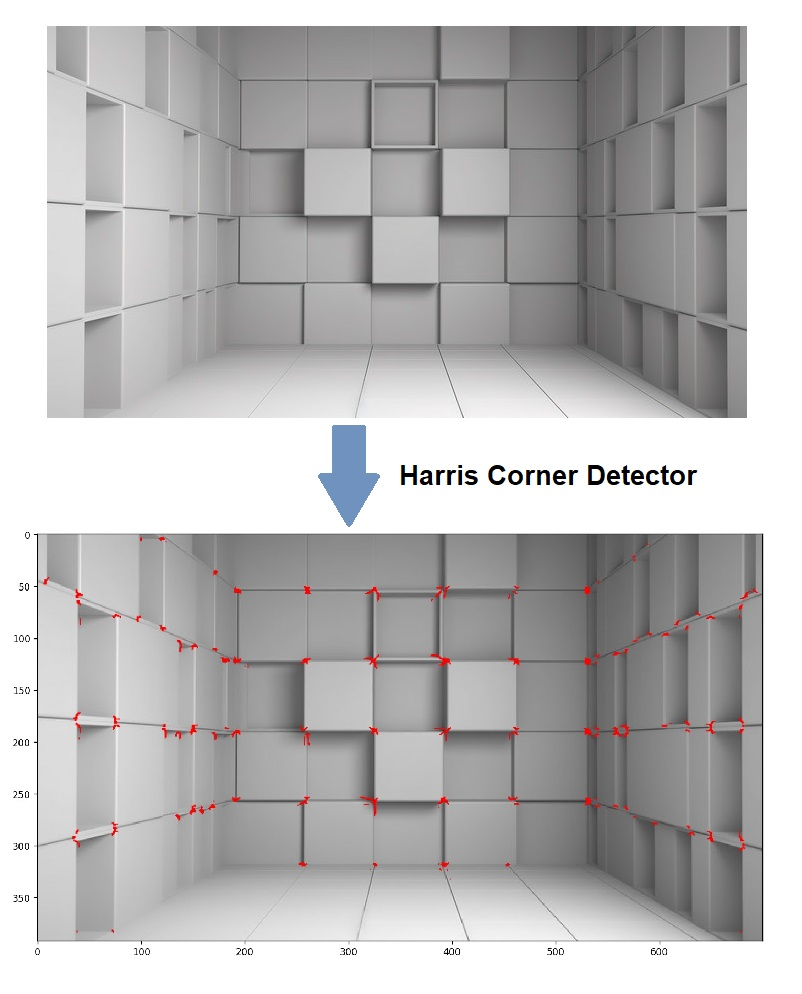

# Harris Corner Detection

This is the implementation of **Harris Corner Detection** from scratch using NumPy with interactive GUI in Python. Following are the steps:
1. Image **gradient** along x and y direction: act as two features for each pixel
2. For each pixel, compute **Edge Correlation matrix (M)** elements:
    - Variance of gradient along x in neighbourhood
    - Variance of gradient along y in neighbourhood
    - Co-variance of gradient along x and y in neighbourhood
3. Determine axes of maximum variances, two axes:
    - **Method 1**: determine eigen values of the Edge Correlation matrix, E1 and E2.
         - E1>>E2 or E1<<E2: Edge pixel
         - E1~E2 and large: Corner pixel
         - E1~E2 and small: None
    - **Method 2**: determine **Cornerness Score**, R = E1.E2 - k (E1+E2)^2 = Det(M) - k.Trace(M)^2
         - R large: Corner

**Sample Output:**

## Contributions
[Saurabh Chatterjee](https://github.com/chatterjeesaurabh)  
MTech, Signal Processing and Machine Learning  
Indian Institute of Technology (IIT) Kharagpur
